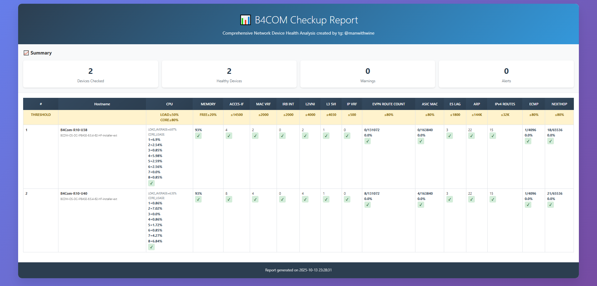

# B4COM Network Checkup System

Скрипт автоматической проверки и анализа устройств B4COM 4100 в решении EVPN/VXLAN.

## 📋 Описание

Данный инструмент предназначен для автоматического сбора и анализа информации с сетевых устройств B4COM CS4100 в решении EVPN/VXLAN.\
Система подключается к устройствам, выполняет набор диагностических команд и генерирует детальные отчеты о состоянии оборудования.



## 🚀 Быстрый старт

### 1. Установка зависимостей

```bash
pip install -r requirements.txt
```
### 2. Настройка конфигурации

Укажите учетный данные для подключения к устройствам в .env файле
```aiignore
# Учетные данные для подключения к устройствам
DEVICE_USERNAME=ваш_username
DEVICE_PASSWORD=ваш_пароль
```
### 3. Подготовка списка устройств

Укажите ip адреса для подклюения к устройствам
```aiignore
1.1.1.1
2.2.2.2
```
### 4. Запуск проверки

Запустите main.py
```
python3 main.py
```

### 5. Генерация отчета

После выполнения будет сгенерирован HTML отчет.
Пример отчета: [report_20251013_2328.html](image%2Freport_20251013_2328.html)

## Структура проекта

```aiignore
b4com_checkup/
├── 📂 core/ # Основные модули системы
│ ├── device_parser.py # Парсер вывода с устройств
│ ├── device_manager.py # Управление подключением и командами
│ └── report_generator.py # Генератор HTML отчетов
├── 📂 metrics/ # Метрики для анализа
│ ├── base_metric.py # Базовый класс для всех метрик
│ ├── cpu_metric.py # Метрика загрузки CPU
│ ├── memory_metric.py # Метрика использования памяти
│ ├── access_if_metric.py # Метрика access-if интерфейсов
│ └── ... (остальные метрики)
├── 📂 config/ # Конфигурационные файлы
│ ├── commands.py # Команды для выполнения на устройствах
│ ├── hw_shell_commands.py # Команды для hw-shell режима
│ ├── thresholds.py # Пороговые значения для метрик
│ ├── tooltips.py # Подсказки для метрик в отчетах
│ └── metrics_config.py # Регистрация всех метрик
├── 📂 templates/ # HTML шаблоны
│ └── report_template.py # Шаблон HTML отчета
├── 📂 utils/ # Вспомогательные утилиты
│ ├── file_utils.py # Работа с файлами
│ └── network_utils.py # Сетевые утилиты
├── 📄 main.py # Основной скрипт сбора данных
├── 📄 parser.py # Скрипт анализа данных и генерации отчетов
├── 📄 .env # Учетные данные устройств
├── 📄 ip.txt # Список IP адресов устройств
└── 📄 requirements.txt # Зависимости Python
```

## Проверяемые метрики

Скрипт отслеживает более 15 ключевых показателей:

| Метрика           | Описание                             |
|-------------------|--------------------------------------|
| CPU               | Загрузка процессора                  |
| Memory            | Использование памяти                 |
| Access Interfaces | VXLAN интерфейсы                     |
| MAC VRF           | Виртуальные маршрутизаторы           |
| IRB Interfaces    | Integrated Routing and Bridging      |
| L2VNI             | Layer 2 VNI                          |
| L3 SVI            | Switched Virtual Interfaces          |
| IP VRF            | IP Virtual Routing                   |
| EVPN Routes Count | MAC-only, MAC-IPv4/v6                |
| ASIC MAC          | MAC-адреса в ASIC                    |
| ES LAG            | EVPN Multihoming сессии              |
| ARP Entries       | ARP записи                           |
| IPv4 Routes       | Маршруты IPv4                        |
| ECMP Groups       | ECMP группы                          |
| L3 Nexthops       | Next-hop записи                      |

```aiignore
⚠️ ВНИМАНИЕ: Пороговые значения зависят от топологии и дизайна сети.
Рекомендуется уточнять актуальные пороги у представителей B4com.
```

## 🛠️ Разработка

### Добавление новых метрик:
1. Добавьте команду в commands.py/hw_shell_commands.py
2. Создайте файл метрики в metrics/new_metric.py
```aiignore
# metrics/new_metric.py
from .base_metric import BaseMetric
from typing import Any, Dict
import re
from config.thresholds import get_threshold

class NewMetric(BaseMetric):
    def __init__(self):
        super().__init__(
            name="new_metric",
            description="New Metric Description",
            display_name="NEW METRIC" # то, как будет отображаться метрика в отчёте
        )
        self.threshold = get_threshold("new_metric")
    
    def extract_value(self, content: str) -> Any:
        # Логика извлечения значения из вывода команд
        match = re.search(r'Your Pattern:\s+(\d+)', content)
        return int(match.group(1)) if match else None
    
    def check_threshold(self, value: int) -> Dict[str, Any]:
        if value <= self.threshold:
            status = "OK"
        else:
            status = "ALERT"
        
        return {
            "status": status,
            "details": f"{value}<br>Result={status}",
            "raw_data": value
        }
```
3. Зарегистрируйте метрику в config/metrics_config.py
```aiignore
from metrics.new_metric import NewMetric

METRICS_REGISTRY = {
    # ... существующие метрики
    "new_metric": NewMetric(),
}
```
4. Добавьте значение порога в config/thresholds.py
```aiignore
THRESHOLDS = {
    # ... существующие пороги
    "new_metric": 100,
}

def get_threshold_row():
    """Возвращает строку с пороговыми значениями для таблиц"""
    return [
        ...
        f"≤{THRESHOLDS['new_metric']}%"
    ]
```
5. Опционально добавьте подсказку в config/tooltips.py
```aiignore
METRIC_TOOLTIPS = {
    # ... существующие подсказки
    "new_metric": "Описание новой метрики\n• Что измеряет\n• Как интерпретировать\n\nПорог: ≤100",
}
```

### Изменение пороговых значений
1. Откройте config/thresholds.py
2. Измените нужные значения


## Логирование ошибок

Ошибки подключения сохраняются в error_log.txt:
```aiignore
2023-12-01 14:30:15: 100.64.0.19 - Connection timeout
2023-12-01 14:31:22: 100.64.0.20 - Authentication failed
```

## 📝 Примечания
* Система автоматически находит последнюю папку с результатами в cfg/
* Все пороговые значения централизованы в thresholds.py
* Новые метрики автоматически появляются в отчетах
* Подсказки в HTML отчетах показываются при наведении на заголовки метрик

При возникновении проблем писать на почту mkmklsfml@gmail.com или в tg: @manwithwine\
v1.0